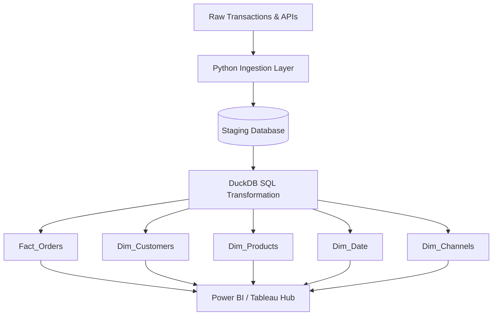

# Architecture Documentation

This directory contains technical design documents, data models, and BI semantic definitions.

## Index

- [Data Dictionary](data_dictionary.md): Exhaustive mapping of tables, relationships, and columns in the star schema.
- [DAX Measures](dax_measures.md): The explicit DAX/LOD measures required for the BI Visualization Layer.

## System Flow Diagram

